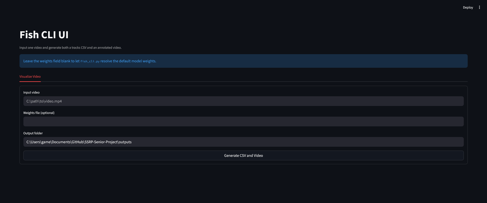

# Domain-General Fish Detection and Tracking

This project detects and tracks fish in video footage using a fine-tuned YOLO model and BoT-SORT tracking. The public inference weights are distributed as `latest.pt`, and the CLI expects that file at `models/latest.pt` by default.

## Installation and Setup

### Prerequisites

- Windows PowerShell
- Python `3.10+`
- An NVIDIA GPU with CUDA support
- A CUDA-enabled PyTorch build
- Optional: `ffmpeg` on `PATH` for MP4 re-encoding during visualization

This project currently requires CUDA for tracking and visualization. CPU-only execution is not supported by the current pipeline.

### 1. Clone the repository

```powershell
git clone https://github.com/saleguas/SSRP-Senior-Project.git
cd SSRP-Senior-Project
```

### 2. Create and activate a virtual environment

```powershell
python -m venv .venv
. .venv\Scripts\Activate.ps1
python -m pip install --upgrade pip
```

### 3. Install PyTorch with CUDA

Install a CUDA-enabled PyTorch build that matches your system by using the official selector:

https://pytorch.org/get-started/locally/

### 4. Install the Python packages used by this repository

```powershell
pip install ultralytics opencv-python pillow numpy pandas matplotlib fastapi "pydantic<3" streamlit
```

### 5. Download the model weights

Download the released model file and place it at `models/latest.pt` in the project root:

```powershell
New-Item -ItemType Directory -Force models | Out-Null
Invoke-WebRequest `
  -Uri https://github.com/saleguas/SSRP-Senior-Project/releases/download/1.0/latest.pt `
  -OutFile models/latest.pt
```

If `models/latest.pt` exists, the CLI will use it automatically when `--weights` is omitted.

### 6. Run the program

Track fish in a new video:

```powershell
python scripts/fish_cli.py run path\to\new_video.mp4 outputs\new_video_tracks.csv
```

Render an annotated output video:

```powershell
python scripts/fish_cli.py visualize path\to\new_video.mp4 outputs\new_video_annotated.mp4
```

If you want to use a different weights file, pass it explicitly:

```powershell
python scripts/fish_cli.py run path\to\new_video.mp4 outputs\new_video_tracks.csv --weights C:\path\to\model.pt
```

### Optional: use the Streamlit UI

Launch the UI with:

```powershell
python scripts/fish_streamlit.py
```

The UI is intentionally simple:

- Required: input video path
- Optional: weights file path
- Defaulted: output folder
- Outputs: `<video_stem>_tracks.csv` and `<video_stem>_visualized.mp4`



## Datasets Used

The active training manifest is `configs/datasets/domain_general_fish.json`. These are the datasets currently used for the domain-general fish detector:

- [AAU Zebrafish ReID](https://www.kaggle.com/datasets/aalborguniversity/aau-zebrafish-reid): tank footage with fish annotations and identity labels
- [MIT Sea Grant River Herring](https://lila.science/datasets/mit-sea-grant-river-herring/): river passage footage with fish bounding boxes
- [Deep Vision fish dataset](https://metadata.nmdc.no/metadata-api/landingpage/01d102345aef4639f063a13ea20cd3f3): fish detection dataset used to widen visual domain coverage
- [Kakadu FishAI Training Data](https://zenodo.org/records/7250921): underwater freshwater fish detection dataset

All training labels are collapsed into a single detection class: `fish`.
